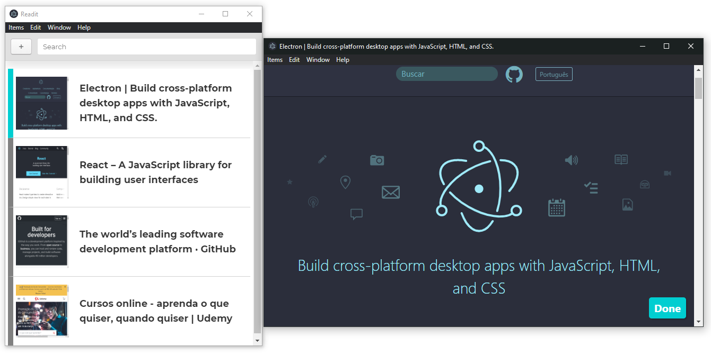
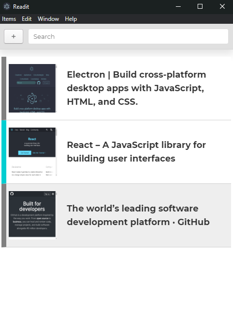
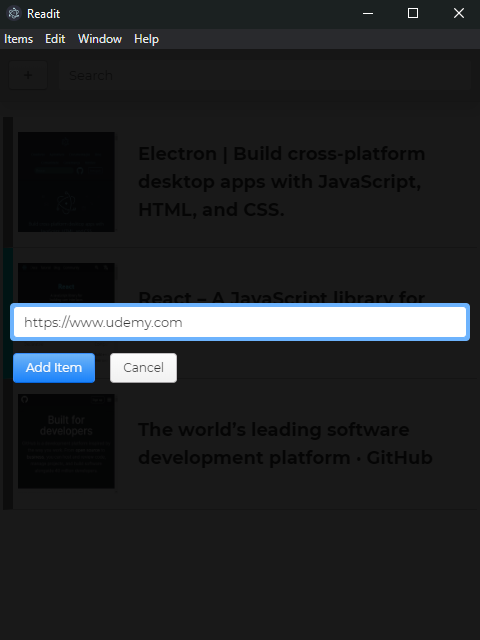

# Readit - Adding your links!

## :boom: Result

## :artificial_satellite: Technologies

This project was built with:
- [Electron](https://www.electronjs.org)
- [Photon](http://photonkit.com)

## :book: About this project

The project is a simple list that you can add links to reading after, you can open them in the application window or your default browser.   
It was the final project of the course: [Master Electron: Desktop Apps with HTML, JavaScript & CSS](https://www.udemy.com/course/master-electron/) under the tutoring of [Ray Viljoen](https://github.com/RayViljoen).

## :memo: License

This project is under the MIT license. Take a look at the [LICENSE](LICENSE.md) file for more details.

